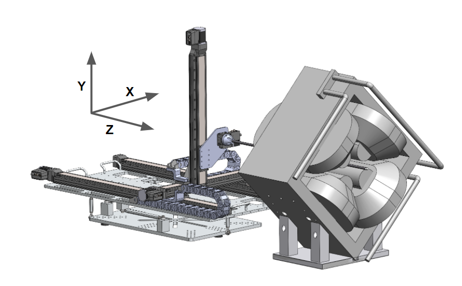

.. Magnet Mapper Control Software documentation master file, created by
   sphinx-quickstart on Thu Apr  7 23:01:50 2022.
   You can adapt this file completely to your liking, but it should at least
   contain the root `toctree` directive.

Welcome to Magnet Mapper Control Software's documentation!
==========================================================

.. toctree::
   :maxdepth: 2
   :caption: Contents
   
   modules
   file_structure

For additional information, please find our project report below. 

Project final report :download:`pdf <media/report.pdf>`

* Appendix 10.2 Zaber Launcher User Guide
* Appendix 10.3 Mapper Control Software

